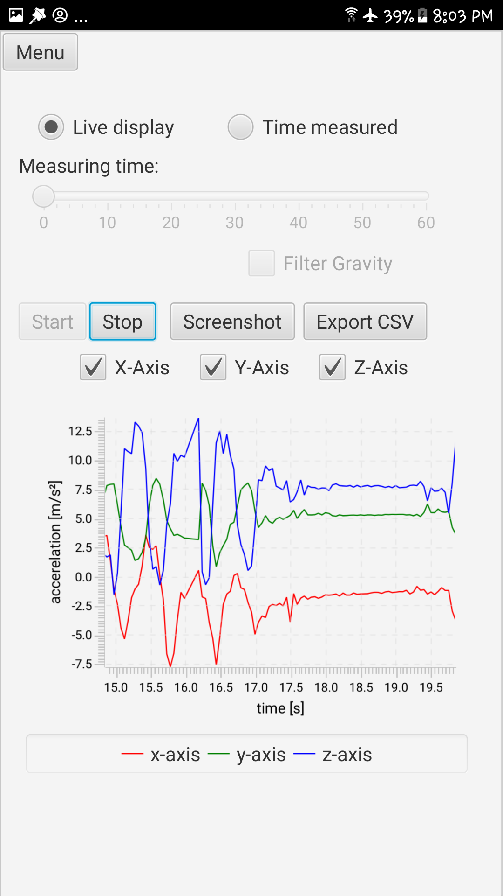
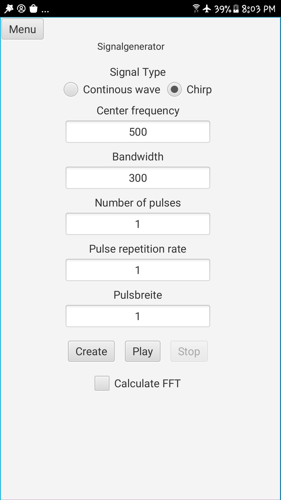
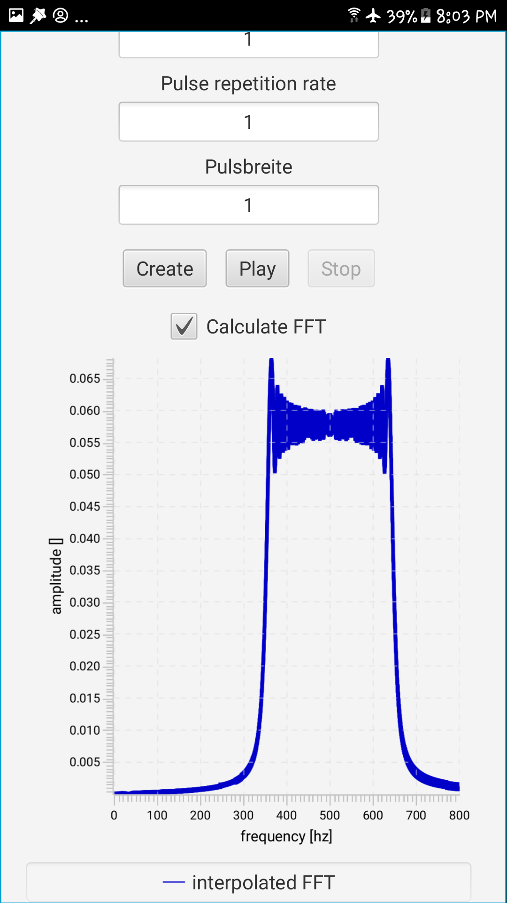

# ScalaOnMobile---Example-App

## Overview

This project explores the migration of Scala applications to mobile platforms, inspired by and building upon the foundational work of [Scala on Android](https://github.com/makingthematrix/scalaonandroid). It serves as a demonstrative example, showcasing the integration of native services via [Gluon Attach](https://gluonhq.com/products/mobile/attach/) without the need for the Gluon Charm Glisten library. The application is developed entirely using free projects offered by Gluon and is available in two versions: Scala and Java, for comparative analysis.

## Features

The application offers two main functionalities:

1. **Acceleration Data Visualization:**
   - Reads and displays acceleration data in a graph.
   - Allows exporting the graph as a screenshot and the data as CSV files.

2. **Audio Signal Generation:**
   - Generates Continuous Wave or Chirp signals.
   - Plays the audio within the app.
   - Saves the audio file in an external directory managed by Gluon.
  
  

  
  
  

## Implementation

The project contains two main directories, each hosting a version of the application:

- `Scala_App`: The Scala implementation.
- `Java_App`: The Java implementation.

For Android and iOS, pre-packaged APK files are available, facilitating easy installation and testing. The iOS versions were created via GitHub Actions and are not fully tested due to the missing hardware.

## Getting Started

- For Android development there is the more detailed tutorial on prerequisities and installation steps on the [Scala Website](https://docs.scala-lang.org/tutorials/scala-on-android.html)
- The official [Gluon Documentation](https://docs.gluonhq.com/) gives a very detailed information on prerequisities and installation steps
  
### Prerequisites

- Install [Gluons Version](https://github.com/gluonhq/graal/releases/tag/gluon-22.1.0.1-Final) of GraalVM
- gcc version 6 or higher
- ld version 2.26 or higher
- Recommended to use [IntelliJ](https://www.jetbrains.com/idea/?var=1) or [NetBeans](https://netbeans.apache.org/front/main/index.html) as IDE with the Scala and JavaFX Plugins
- Maven (In this Project I used version 3.8.8)
- For Android development, Linux is required
- For Linux: installing following Packages:
      apt-get install libasound2-dev libavcodec-dev libavformat-dev libavutil-dev libfreetype6-
      dev
      apt-get install libgl-dev libglib2.0-dev libgtk-3-dev libpango1.0-dev libx11-
      dev libxtst-dev zlib1g-dev
- For iOS development, macOS is required.

### Installation

1. Clone the repository:
   git clone https://github.com/thomas7b/ScalaOnMobile---Example-App.git
   
3. Navigate to either the `Scala_App` or `Java_App` directory, depending on your development preference.

4. Follow the [Gluon Documentation](https://docs.gluonhq.com/) instructions specific to your platform (Android/iOS) to build the native image and create the application.

## Contribution

Contributions to the project are welcome.

   
